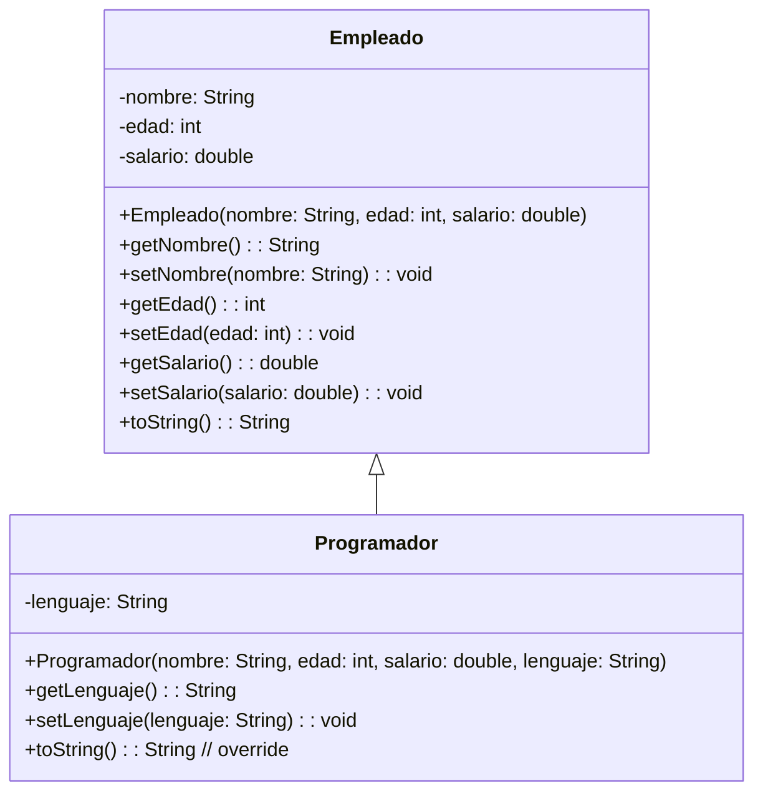

En este ejemplo se muestra como se deriva una clase, de una clase base. Concepto de herencia

## **Ejercicio**

A partir de las clases Empleado:

- Crea la clase Gerente, que incluya el atributo departamento y sobrescriba toString() para incluirlo.
Además, implementa un método extra asignarProyecto(String proyecto) que imprima el proyecto asignado.

- Crea la clase Diseñador, que incluya el atributo herramientaDiseño y sobrescriba toString() para incluirlo.
Además, implementa un método extra crearDiseno() que imprima un mensaje sobre la creación de un diseño.

A partir de la clase Programador:

- Crea la clase ProgramadorBackend, con el atributo frameworkBackend y sobrescribe toString() para incluirlo.
Además, implementa un método extra desplegarAPI() que imprima un mensaje sobre el despliegue de una API.

- Crea la clase ProgramadorFrontend, con el atributo frameworkFrontend y sobrescribe toString() para incluirlo.
Además, implementa un método extra diseñarInterfaz() que imprima un mensaje sobre el diseño de una interfaz.

Modifica la clase principal existente Principal.java para que:

- Instancie un objeto de cada una de las nuevas clases (Gerente, Diseñador, ProgramadorBackend, ProgramadorFrontend).

- Llame a mostrarInformacion() para cada objeto y verifique la salida.

- También invoque los métodos extra que implementaste en cada clase derivada para demostrar la especialización.