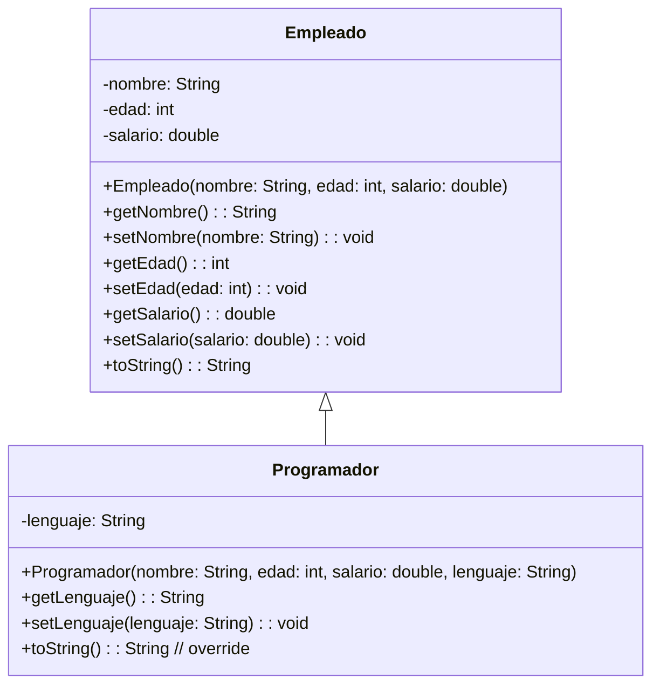

En este ejemplo se muestra como se deriva una clase, de una clase base. Concepto de herencia

```mermaid
classDiagram
    class Empleado {
        -nombre: String
        -edad: int
        -salario: double
        +Empleado(nombre: String, edad: int, salario: double)
        +getNombre(): String
        +setNombre(nombre: String): void
        +getEdad(): int
        +setEdad(edad: int): void
        +getSalario(): double
        +setSalario(salario: double): void
        +toString(): String
    }

    class Programador {
        -lenguaje: String
        +Programador(nombre: String, edad: int, salario: double, lenguaje: String)
        +getLenguaje(): String
        +setLenguaje(lenguaje: String): void
        +toString(): String // override
    }

    Empleado <|-- Programador
```

