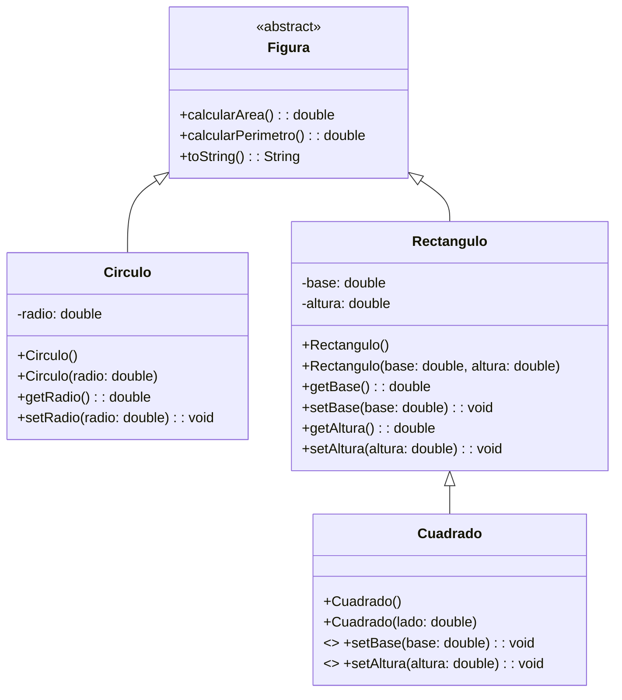

En este ejemplo encontrará la forma de declarar una clase abstracta en Java, así como la forma de sobreescribir los métodos abstractos en las clases derivadas

```mermaid
classDiagram
    class Figura {
        <<abstract>>
        +calcularArea(): double
        +calcularPerimetro(): double
        +toString(): String
    }

    class Circulo {
        -radio: double
        +Circulo()
        +Circulo(radio: double)
        +getRadio(): double
        +setRadio(radio: double): void
    }

    class Rectangulo {
        -base: double
        -altura: double
        +Rectangulo()
        +Rectangulo(base: double, altura: double)
        +getBase(): double
        +setBase(base: double): void
        +getAltura(): double
        +setAltura(altura: double): void
    }

    class Cuadrado {
        +Cuadrado()
        +Cuadrado(lado: double)
        <<override>> +setBase(base: double): void
        <<override>> +setAltura(altura: double): void
    }

    Figura <|-- Circulo
    Figura <|-- Rectangulo
    Rectangulo <|-- Cuadrado
```
