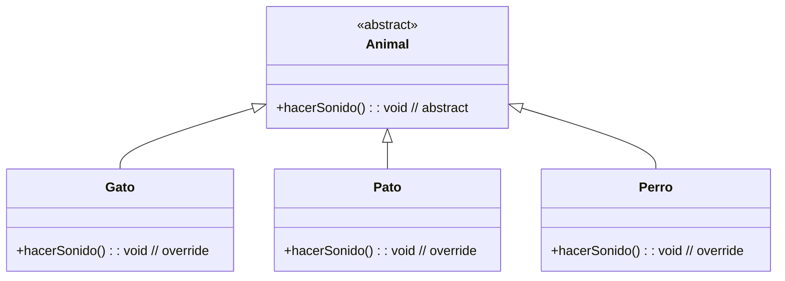

En este ejemplo se presenta el uso del polimorfismo

```mermaid
classDiagram
    class Animal {
        <<abstract>>
        +hacerSonido(): void // abstract
    }

    class Gato {
        +hacerSonido(): void // override
    }

    class Pato {
        +hacerSonido(): void // override
    }

    class Perro {
        +hacerSonido(): void // override
    }

    Animal <|-- Gato
    Animal <|-- Pato
    Animal <|-- Perro
```
