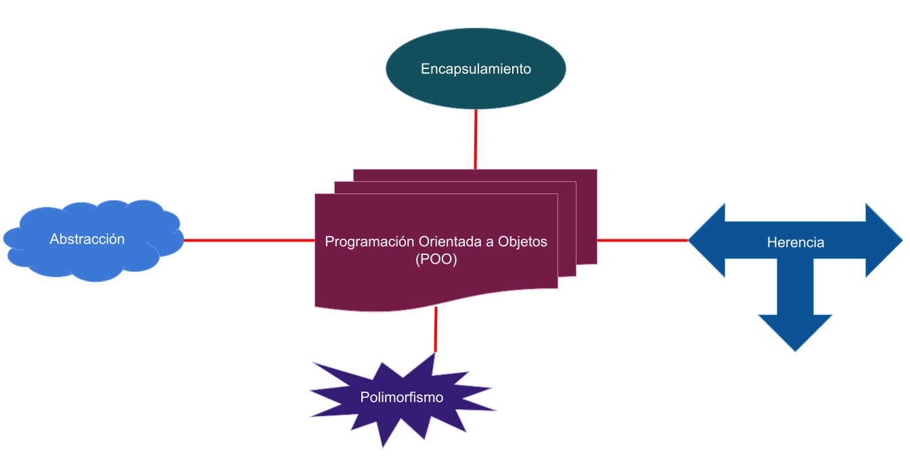
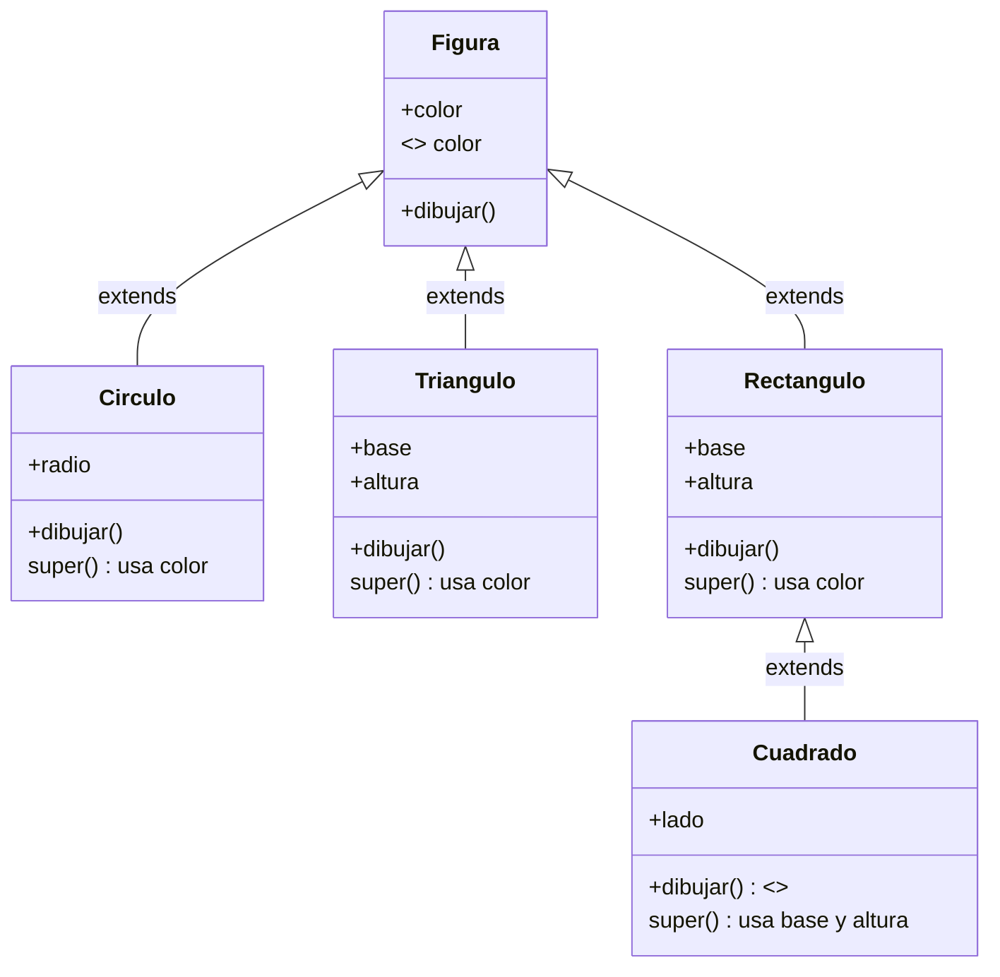

# Tema 1: Programación Orientada a Objetos Básica

Este tema cubre los conceptos fundamentales de la Programación Orientada a Objetos (POO) y sus características principales: **abstracción, encapsulamiento, herencia y polimorfismo**.

---

## Características principales de la POO

- **Abstracción**: Enfoque en los aspectos esenciales de un objeto, ocultando los detalles internos irrelevantes para el contexto.
- **Encapsulamiento**: Agrupar los elemntos relacionados del objeto, ocultando los detalles internos y dando acceso controlado a través de métodos definidos.
- **Herencia**: Mecanismo por el cual una clase puede adquirir las propiedades y comportamientos de otra.
- **Polimorfismo**: Capacidad de un objeto de adoptar múltiples formas, permitiendo diferentes comportamientos para un mismo método.

> **Figura 1**: Diagrama conceptual de las 4 características de la POO.  
> 

---

## 1.1 Tipo de Dato Abstracto (TDA)

Un **Tipo de Dato Abstracto (TDA)** es un modelo que combina **representación de datos** y **operaciones**.  
Para recordar: `TDA = Representación (datos) + Operaciones (funciones y procedimientos)`.

**Ventajas de los TDA**:
1. Mejor modelado del mundo real.
2. Mayor robustez y control de tipos.
3. Separación de implementación y especificación.
4. Extensibilidad y reutilización.
5. Representación clara de la semántica del tipo.

---

## 1.2 Clases y Objetos

Una **clase** es un tipo de dato abstracto (TDA) que **define la estructura y el comportamiento** de un conjunto de objetos. Especifica **atributos** (representan el estado del objeto) (**abstracción y encapsulamiento**) y **métodos** (definen las operaciones que puede realizar) (**polimorfismo y encapsulamiento**), separando la interfaz pública de la implementación interna (**encapsulamiento**). Además, una clase puede heredar atributos y métodos de otras clases (**herencia**), y permitir que sus métodos se comporten de forma distinta en las subclases (**polimorfismo**).  
Un **objeto** es una instancia de una clase.

**Atributos**:
- Representan el estado del objeto.
- Pueden tener modificadores de acceso (`public`, `private`, `protected`).

| Tipo de miembro | Misma clase | Clase derivada | Mismo paquete | Otro paquete |
|-----------------|-------------|----------------|---------------|--------------|
| **private**     | ✔           | ✘              | ✘             | ✘            |
| *(sin especificar)* | ✔       | ✘              | ✔             | ✘            |
| **protected**   | ✔           | ✔              | ✔             | ✘            |
| **public**      | ✔           | ✔              | ✔             | ✔            |

**Métodos**:
- Definen el comportamiento del objeto.
- Pueden consultar o modificar atributos.

**Constructores**:
- Inicializan objetos al crearlos (`new`).
- Pueden ser por defecto o con parámetros.

**Gestión de memoria**:
- Java libera memoria automáticamente mediante *Garbage Collection*.

**Estructura básica**:
```java
public class EstructuraBasica {
    private int atributo1;
    protected char atributo2;
    public double atributo3;
    ...
    // Constructor sin parámetros
    public EstructuraBasica (){
        ...
    }

    // Métodos
    public void metodo1 (//parametros){
        ...
    }
    private int metodo2 (//parametros){
        ...
    }
    protected char metodo3 (//parametros){
        ...
    }
}
```

---

## 1.3 Clases Derivadas y Herencia

- **extends**: Permite que una clase herede atributos y métodos de otra.
- Miembros `private` no se heredan.
- Se pueden **sobrecargar** métodos cambiando la cantidad y/o típo de los parámetros.




**Reglas**:
1. El constructor de la clase base se invoca antes del constructor de la clase derivada.
2. Si una clase base es, a su vez, una clase derivada, se invocan siguiendo la misma secuencia: constructor de la clase base, constructor de la clase derivada.
3. Los constructores no se heredan.
4. Si no se especifica el constructor de la clase base, se invoca el constructor sin argumentos.
5. La palabra reservada `super` permite acceder a cualquier miembro de la clase base (siempre que no sea privado), `super()` por ejemplo, llama al constructor de la clase base.
6. `final`: Evita que una clase o método sea heredado o sobrescrito.
7. Al declarar una clase como extensión o derivada de otra clase, los objetos de la clase derivada son a su vez objetos de la clase base

---

## 1.4 Clases Abstractas

- Declaradas con `abstract`.
- Tienen al menos un método abstracto (**sin implementación**).
- No se pueden instanciar directamente.
- Las clases derivadas deben implementar los métodos abstractos o también ser clases abstractas.

---

## 1.5 Polimorfismo

Permite que diferentes objetos respondan de forma distinta al mismo mensaje.

**Aplicaciones**:
- Especialización de clases.
- Estructuras de datos heterogéneas.
- Gestión flexible de jerarquías.

---

## 1.6 Manejo de Excepciones

Una **excepción** es un error detectado en tiempo de ejecución.

**Estructura básica**:
```java
try {
    // Código que puede lanzar una excepción
} catch (TipoDeExcepcion e) {
    // Manejo de la excepción
} finally {
    // Código que siempre se ejecuta
}
```

**Ejemplos de excepciones comunes**:
- `ArithmeticException`: División por cero.
- `ArrayIndexOutOfBoundsException`: Índice fuera de rango.
- `NullPointerException`: Referencia nula.

---

## Este documento resume el contenido teórico del **Tema 1**.  
Para ejemplos completos de código, consulte los archivos `.java` en esta carpeta.